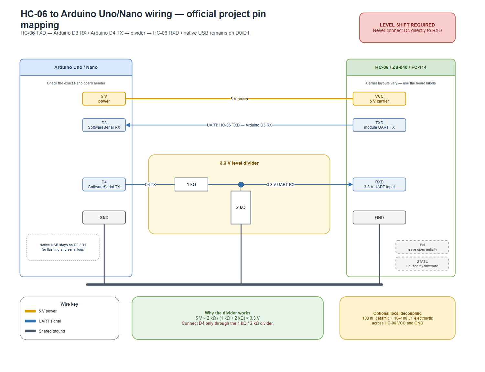

# IntegriScan breathalyzer firmware

Target hardware: 5 V Arduino Uno or ATmega328P Nano, MQ-3 on `A0`, passive
buzzer on `D8`, and a six-pin ZS-040/FC-114 HC-06 Bluetooth Classic module.

**Official project UART mapping:** HC-06 `TXD` connects to Arduino `D3`
(SoftwareSerial RX), while Arduino `D4` (SoftwareSerial TX) drives HC-06 `RXD`
through the required 1 kΩ / 2 kΩ divider. Do not use the former `D10` / `D11`
mapping for new connections.

The sketch stores these pins as the portable numeric values `3` and `4`.
Some Arduino board cores do not expose the `D3` and `D4` symbol aliases even
though those physical header pins are present; the numeric constants compile
across those cores without changing the Uno/Nano pin assignment.

The sketch sends the same CRLF-delimited JSON telemetry to:

- USB serial on the Arduino's native `D0`/`D1` port; and
- HC-06 SPP at `9600` baud using `SoftwareSerial`.

USB serial remains separate, so the HC-06 does not have to be disconnected to
flash the Arduino. Mirroring the roughly 120-byte record at 9600 baud produces
about two readings per second on an Uno/Nano.

## HC-06 wiring

| ZS-040 pin | Connect to | Notes |
| --- | --- | --- |
| `VCC` | Arduino `5V` | The carrier accepts 3.6–6 V. Do not power it from `3V3`. |
| `GND` | Arduino `GND` | The Arduino and module must share ground. |
| `TXD` | Arduino `D3` | Module TX crosses to the Arduino SoftwareSerial RX input. Direct 3.3 V signal is safe. |
| `RXD` | `D4 → 1 kΩ → RXD`, with `2 kΩ` from `RXD` to `GND` | The divider reduces the Arduino's 5 V TX signal to approximately 3.3 V. |
| `EN` | Not connected initially | Carrier wiring varies. Use a 3.3 V normal-mode level only if the exact board documentation or continuity test requires it; never use 5 V. |
| `STATE` | Not connected | Optional connection-status output; the firmware does not use it. |

Protect the Arduino-to-HC-06 TX line with the 1 kΩ / 2 kΩ divider shown below:

[](./diagrams/hc06-arduino-wiring.drawio)

[Open the editable draw.io source](./diagrams/hc06-arduino-wiring.drawio).

Do **not** connect Arduino `D4` directly to HC-06 `RXD`; the direct 5 V signal
can damage the 3.3 V Bluetooth module. `D4` is the Arduino TX pin and must reach
`RXD` only through the 1 kΩ / 2 kΩ divider. `D3` is the Arduino RX pin and
connects directly to module `TXD`. Do not reverse `TXD` and `RXD`. Leave
`EN` open for the initial test because ZS-040/FC-114 clones wire it differently.
If the exact board is documented to require a high normal-mode level, connect
`EN` to 3.3 V (never 5 V).

For a longer power lead, add a `10-100 uF` electrolytic capacitor and a `100 nF`
ceramic capacitor across the module's `VCC` and `GND`, close to the module.
Power both boards from the same adequately rated 5 V source where possible.
Independently powering the HC-06 while USB drives the Arduino input can
back-power the module through `TXD`; use proper level translation if separate
power supplies are unavoidable. Ensure the Arduino's 5 V regulator has capacity
for the HC-06 (roughly 30–50 mA) plus the MQ-3 heater and other loads.

## Flash the firmware

Arduino IDE:

1. Disconnect USB power before changing wires.
2. Wire the HC-06 as shown above.
3. Open `firmware/breathalyzer/breathalyzer.ino`.
4. Select the exact board (`Arduino Uno` or `Arduino Nano`) and its COM/serial
   port.
5. Upload the sketch. The HC-06 can remain connected because the firmware does
   not use `D0`/`D1` for Bluetooth.
6. Open the serial monitor at `9600` baud. The MQ-3 warm-up flag is expected to
   remain `true` for the first 60 seconds.

Command-line equivalent when the Arduino CLI is installed:

```powershell
arduino-cli compile --fqbn arduino:avr:uno firmware/breathalyzer
arduino-cli upload -p <COM_PORT> --fqbn arduino:avr:uno firmware/breathalyzer
```

Use `--fqbn arduino:avr:nano` instead when compiling/uploading to a Nano.

## Verify Bluetooth output

1. Pair the module from Android Bluetooth settings. Common default names are
   `HC-06`, `ZS-040`, or `HC-06S`. Common pairing PINs are `1234` or `0000`.
2. Open a Bluetooth Classic SPP terminal app and connect to the paired module.
3. Select `9600` baud if the app exposes a baud setting.
4. Confirm that complete JSON lines arrive, for example:

```json
{"raw":120,"avg":118,"peak":120,"sn":"MQ3-0001","vout":0.587,"rs":7525,"over":false,"alarm":false,"warm":true}
```

If USB serial works but Bluetooth does not, check `TXD`/`RXD`, the divider,
pairing, and the `9600` setting. If the exact carrier requires `EN`, verify its
normal-mode level before connecting it. If the module repeatedly resets or the
Arduino browns out, fix the power supply and decoupling first.

## Before enforcement use

The Bluetooth transport is suitable for bench testing, but the following existing safety gaps must be resolved and validated before roadside or legal use:

1. The current app excludes readings marked `warm` from the subject peak, but
   the 60-second firmware warm-up flag is not a validated stabilization test.
2. The app rejects captures when the latest valid reading is more than three
   seconds old. Remaining gaps are the no-first-data connected-socket case and
   incomplete clearing of previously captured dashboard state after a disconnect
   or asynchronous device error.
3. `DEVICE_SERIAL` is currently `MQ3-0001`; every physical unit needs a unique, controlled identifier.
4. The factory Bluetooth PIN and plain serial payload do not provide strong device authenticity or non-repudiation.
5. `ALARM_THRESHOLD` is an ADC threshold, not a statutory BAC limit. The app's configured BAC calculation is an uncalibrated screening estimate until fitted and validated against an approved reference procedure.
6. Characterize the mirrored stream's roughly 2 Hz sample rate against the intended breath peak before relying on peak capture.

Do not use human breath, automotive exhaust, methanol, or improvised flammable
substances for calibration. Use an approved calibrated reference system.

## Current mobile-app integration

The current Android working tree contains a native Bluetooth Classic RFCOMM/SPP
implementation for this HC-06. Pair the module in Android Settings, then select
it from the in-app `CONNECT HC-06` picker. The physical path requires a native
development/EAS APK and does not run in Expo Go. It is Android-only and is not
yet committed/deployed with the rest of the release candidate.

The simulator remains a separate, explicitly labelled transport and is not an
automatic fallback after an HC-06 connection failure. `react-native-ble-plx`
cannot connect to this Classic SPP module, and normal iOS apps do not support
arbitrary Bluetooth Classic peripherals.

This MQ-3 prototype and its uncalibrated output are for development/testing, not
an evidential or legally certified breathalyzer measurement.
